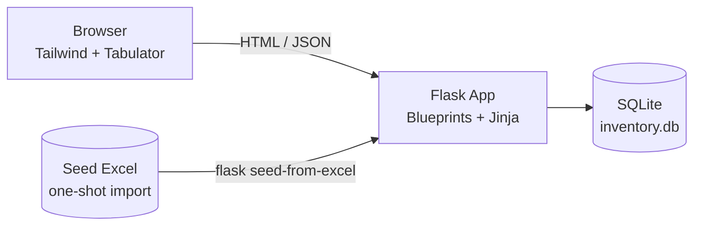

# Inventarisasi KIB-E

A web application for managing **KIB-E government asset inventory** — *Buku* (books),
*Barang Bercorak Kesenian* (art), and *Hewan & Tumbuhan* (animals & plants) — for
**Badan Pengelola Keuangan dan Aset DIY** (Yogyakarta, Indonesia).

It replaces a manual Excel workflow (~1,632 rows × 33 columns in a single
`Worksheet` sheet, plus four reference sheets used as dropdowns) with a structured
database-backed app: a guided entry form, an editable spreadsheet view, and a
quick dashboard. Editing the spreadsheet directly was error-prone — duplicate
primary keys (`NIBAR`), inconsistent dropdown values, and no way to spot duplicate
titles — so this app enforces those invariants instead.

## Features

- **Dashboard** (`/`) — read-only overview grid (`NIBAR` + `Judul Buku`) with search and pagination.
- **New Entry** (`/entry`) — guided form with the 33 columns grouped into scannable cards.
  `Judul Buku` and `NIBAR` get **live similar-name lookup** (debounced) to warn about
  duplicates before submitting; the server still enforces `NIBAR` uniqueness (HTTP 409).
- **Master Table** (`/master`) — full editable grid over all columns; cell edits save via
  `PATCH` per change, with dropdown editors sourced from the master tables.
- **Photo uploads** with automatic compression (max dimension + JPEG quality limits, size cap).
- **Sensible defaults** — new/seeded rows auto-fill institutional values (e.g. `6-APBD`
  asal-usul, default room, custodian names) without overwriting curated data.
- **Excel round-trip** — seed the DB from the tracked template, and export back to a
  filled 38-column workbook with embedded foto thumbnails (`scripts/export_v2.py`).
- **JSON API** with Marshmallow validation and field-level error messages.

## Tech stack

| Layer    | Choice                                                        |
|----------|---------------------------------------------------------------|
| Backend  | Flask + Flask-SQLAlchemy + Flask-Migrate, Marshmallow         |
| Database | SQLite (`instance/inventory.db`, local-only)                  |
| Frontend | Server-rendered Jinja + Tailwind CDN, Tabulator grids (CDN)   |
| Excel    | `openpyxl` (seed + export), `Pillow` (foto handling)          |

No Node.js, no build step — CDN assets only.



## Project structure

```
├── app/
│   ├── blueprints/     # page routes: dashboard (/), entry (/entry), master (/master)
│   ├── api/            # JSON API: inventory CRUD, similar-name search, masters
│   ├── services/       # excel_import (seed CLI), inventory_defaults
│   ├── templates/      # Jinja pages (base layout + sidebar)
│   └── static/js/      # Tabulator grids, entry-form interactions
├── assets/templates/   # tracked seed workbook (read-only input, never written to)
├── scripts/            # DB → Excel export tooling (+ archived one-shots)
├── exports/            # generated workbooks (local-only, gitignored)
├── instance/           # SQLite database (local-only, gitignored)
├── migrations/         # Flask-Migrate
├── tests/              # unittest suite (in-memory SQLite)
├── inventarisasi-docs/ # detailed docs: architecture, data model, pages, API, setup
├── config.py           # Flask config (incl. foto limits, seed path)
└── run.py              # app entrypoint
```

## Quickstart (Windows / PowerShell)

Prerequisites: Python 3.11+ and a modern browser.

```powershell
# 1. Create and activate a venv
python -m venv venv
.\venv\Scripts\Activate.ps1

# 2. Install dependencies
pip install -r requirements.txt

# 3. Create the schema and seed from the Excel template
$env:FLASK_APP = "run.py"
flask db upgrade
flask seed-from-excel
# expected: MasterKondisi: 3, MasterSatuan: 39, MasterRuang: 65,
#           MasterBarang: 417, InventoryItem: 1632

# 4. Run the dev server
flask run
```

Open <http://127.0.0.1:5000> — `/` dashboard, `/entry` new entry, `/master` master table.

Production-ish serving via Waitress:

```powershell
pip install waitress
waitress-serve --listen=0.0.0.0:7000 run:app
```

## Useful commands

| Command | What it does |
|---|---|
| `flask seed-from-excel` | Purge all tables and reload everything from the seed workbook (idempotent). |
| `flask backfill-inventory-defaults` | Fill blank default fields on existing rows; never overwrites non-blank values. |
| `flask db migrate -m "..."` / `flask db upgrade` | Generate / apply migrations after editing `app/models.py`. |
| `python scripts/export_v2.py` | Export DB → `exports/Format_Excel_KIBE_v2.xlsx` with foto thumbnails. |
| `python -m unittest discover -s tests` | Run the test suite. |

To reset the database: delete `instance/inventory.db`, then `flask db upgrade` + `flask seed-from-excel`.

## Data notes

- The Excel template in `assets/templates/` is the **seed source only** — the app never writes to it.
- After seeding, the SQLite database is the source of truth.
- `instance/inventory.db` and `exports/` are gitignored local state; a fresh clone rebuilds them via the commands above.

## Further reading

- `inventarisasi-docs/00-Index.md` — doc hub
- `inventarisasi-docs/01-Architecture.md` — system design and request flows
- `inventarisasi-docs/02-Data-Model.md` — schema and column-by-column Excel mapping
- `inventarisasi-docs/03-Pages-and-Flows.md` — UI behavior per page
- `inventarisasi-docs/04-API.md` — JSON endpoint reference
- `inventarisasi-docs/05-Setup.md` — setup and troubleshooting
- `scripts/README.md` — export tooling
