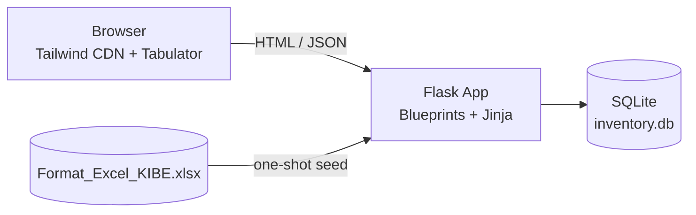

# Architecture

## High-level diagram



The app is a single Flask process. The browser pulls Tailwind and Tabulator from CDNs (no build step). The SQLite file lives in `instance/inventory.db`. Initial data is loaded once from the Excel file via a `flask seed-from-excel` CLI command.

## Folder layout

```
inventarisasi-kib-e/
├── app/
│   ├── __init__.py            # Flask app factory; wires extensions and blueprints
│   ├── extensions.py          # SQLAlchemy + Migrate singletons
│   ├── models.py              # InventoryItem + 4 master tables
│   ├── blueprints/
│   │   ├── main.py            # GET /        -> dashboard
│   │   ├── entry.py           # GET /entry   -> new entry form
│   │   └── master_table.py    # GET /master  -> full grid
│   ├── api/
│   │   ├── inventory.py       # /api/inventory CRUD
│   │   ├── search.py          # /api/inventory/search (similar-name lookup)
│   │   └── masters.py         # /api/masters/<type> dropdown sources
│   ├── services/
│   │   └── excel_import.py    # openpyxl loader; bound to flask CLI
│   ├── templates/
│   │   ├── base.html          # left sidebar layout
│   │   ├── dashboard.html
│   │   ├── new_entry.html
│   │   └── master_table.html
│   └── static/js/
│       ├── dashboard.js       # Tabulator (read-only, 2 cols)
│       ├── new_entry.js       # debounced /search calls + form submit
│       └── master_table.js    # Tabulator (editable, 33 cols)
├── instance/inventory.db      # gitignored
├── migrations/                # Flask-Migrate
├── inventarisasi-docs/        # this vault
├── Format_Excel_KIBE.xlsx     # seed source
├── config.py
├── run.py
└── requirements.txt
```

## Request flow

### Page request (e.g., `GET /master`)
1. `app/__init__.py` resolves the blueprint `master_table.bp`.
2. The view renders `master_table.html`, which extends `base.html` (sidebar + Tailwind CDN tag).
3. The browser loads `master_table.js`, which initializes Tabulator and fetches data via `GET /api/inventory`.
4. Dropdown editors fetch their option lists from `/api/masters/<type>` once, on grid init.
5. Edits dispatch `PATCH /api/inventory/<nibar>` per cell change.

### Seed flow (one-shot)
1. Operator runs `flask seed-from-excel`.
2. `app/services/excel_import.py` opens the workbook (read-only with `openpyxl`).
3. Master sheets (`MASTER KONDISI`, `MASTER SATUAN`, `MASTER RUANG`, `MASTER BARANG`) are loaded into their lookup tables.
4. `Worksheet` rows are normalized (looked up against masters by display string) and bulk-inserted into `inventory_item`.
5. Counts are printed.

## Conventions

- **Blueprints** for page routes (return HTML); **API blueprints** for JSON. Keeps boundaries clean.
- All JSON validation in API handlers (Marshmallow schemas).
- Database is the source of truth after seeding. The Excel file is never written to.
- Foreign keys point to surrogate `id` columns on master tables; the original `kode` strings are preserved on each master row for re-export.

See [[02-Data-Model]] for schema, [[04-API]] for endpoints.
