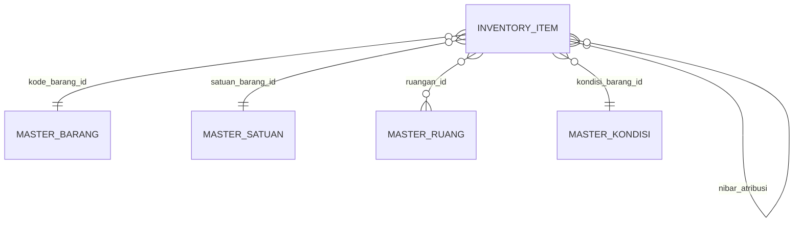

# Data Model

The schema mirrors `Format_Excel_KIBE.xlsx`. The `Worksheet` sheet becomes `inventory_item`; the four reference sheets become master lookup tables.

## ER overview



## Master tables

Each master table has the same shape:

| Column | Type        | Notes                                          |
|--------|-------------|------------------------------------------------|
| id     | int PK      | surrogate, autoincrement                       |
| kode   | str unique  | leading code parsed from the Excel display     |
| nama   | str         | full display string (used for dropdown labels) |

| Table              | Source sheet      | Rows | Used by Worksheet column |
|--------------------|-------------------|------|--------------------------|
| `master_kondisi`   | MASTER KONDISI    |    3 | T — Kondisi Barang       |
| `master_satuan`    | MASTER SATUAN     |   39 | L — Satuan Barang        |
| `master_ruang`     | MASTER RUANG      |   65 | S — Ruangan              |
| `master_barang`    | MASTER BARANG     |  417 | C — Kode Barang          |

## `inventory_item`

Primary key is `nibar` (user-supplied integer — **not** autoincrement). Required columns are non-null; the rest are nullable to match operator workflows where partial entries are common.

| Excel col | Field                        | Type         | Null | Notes                                                              |
|-----------|------------------------------|--------------|------|--------------------------------------------------------------------|
| A         | `nibar`                      | BigInt PK    |  no  | "Nibar / Kodekib" — user-supplied unique asset id                  |
| B         | `kode_register`              | str          |  no  | Sequential registration code, e.g. "000001"                        |
| C         | `kode_barang_id`             | FK Barang    |  no  | → `master_barang.id`                                               |
| D         | `tahun_perolehan`            | int          |  no  | Acquisition year                                                   |
| E         | `nilai_perolehan`            | BigInt       |  no  | Acquisition value (Rp)                                             |
| F         | `spesifikasi`                | text         |  yes | General specification                                              |
| G         | `jenis_aset`                 | enum         |  no  | `BUKU`, `BARANG BERCORAK KESENIAN`, `HEWAN & TUMBUHAN`             |
| H         | `judul_buku`                 | str          |  yes | Book title (indexed for similar-name lookup)                       |
| I         | `pencipta_buku`              | str          |  yes | Author / creator                                                   |
| J         | `spesifikasi_buku`           | text         |  yes |                                                                    |
| K         | `jumlah_barang`              | int          |  no  | Quantity                                                           |
| L         | `satuan_barang_id`           | FK Satuan    |  no  | → `master_satuan.id`                                               |
| M         | `status_keberadaan`          | enum         |  yes | `hilang`, `tidak ditemukan`                                        |
| N         | `jml_keberadaan`             | int          |  yes | Count of missing/unfound                                           |
| O         | `merupakan_atribusi`         | enum         |  yes | `ya`, `tidak`                                                      |
| P         | `nibar_atribusi`             | BigInt       |  yes | Soft self-reference (no FK constraint, to ease seed order)         |
| Q         | `alamat`                     | str          |  yes |                                                                    |
| R         | `koordinat`                  | str          |  yes |                                                                    |
| S         | `ruangan_id`                 | FK Ruang     |  yes | → `master_ruang.id`                                                |
| T         | `kondisi_barang_id`          | FK Kondisi   |  no  | → `master_kondisi.id`                                              |
| U         | `merk_type`                  | str          |  yes |                                                                    |
| V         | `penggunaan`                 | enum         |  yes | `pemerintah daerah`, `pemerintah pusat`, `pemerintah daerah lainnya`, `pihak lain` |
| W         | `nama_kuasa`                 | str          |  yes |                                                                    |
| X         | `nama_pemakai`               | str          |  yes |                                                                    |
| Y         | `status_pemakai`             | str          |  yes |                                                                    |
| Z         | `bast`                       | enum         |  yes | `ada`, `tidak`                                                     |
| AA        | `nama_dasar_penggunaan`      | str          |  yes |                                                                    |
| AB        | `nama_dokumen`               | str          |  yes |                                                                    |
| AC        | `nibar_tercatat_ganda`       | str          |  yes | Free-text indicator from source                                    |
| AD        | `deskripsi_barang`           | text         |  yes |                                                                    |
| AE        | `keterangan`                 | text         |  yes |                                                                    |
| AF        | `petugas`                    | text         |  yes | Semicolon-separated, kept as plain string                          |
| AG        | `foto`                       | str          |  yes | Path under `app/static/uploads/` (upload not yet implemented)      |
| —         | `created_at`                 | datetime     |  no  | audit                                                              |
| —         | `updated_at`                 | datetime     |  no  | audit                                                              |

## Indexes

- `inventory_item(nibar)` — primary key.
- `inventory_item(judul_buku)` functional index on `lower(judul_buku)` — backs the similar-name autocomplete on the New Entry page.
- Foreign-key columns auto-indexed by SQLAlchemy.

## Enums

Stored as strings (SQLite has no native enum). Validation lives in the Marshmallow schemas in [[04-API]].

```
JenisAset     = {BUKU, BARANG BERCORAK KESENIAN, HEWAN & TUMBUHAN}
StatusKeberadaan = {hilang, tidak ditemukan}
YaTidak       = {ya, tidak}    # for merupakan_atribusi
AdaTidak      = {ada, tidak}   # for bast
Penggunaan    = {pemerintah daerah, pemerintah pusat, pemerintah daerah lainnya, pihak lain}
```
